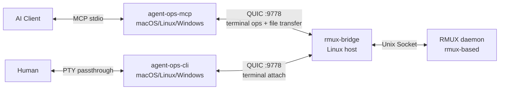

# agent-ops

> Secure infrastructure for AI agents and human operators managing Linux hosts — persistent terminal sessions powered by rmux, full-chain audit logging, MCP-native interface for AI clients + CLI PTY passthrough for humans, with file transfer and multi-host orchestration.

[中文文档](README.zh.md)

## Why agent-ops?

AI agents have evolved from "generating commands for humans" to **autonomously operating terminals** — deploying services, diagnosing failures, running long builds and training jobs, all without human intervention. But traditional terminal tools (SSH, tmux) were designed for human interaction, not programmatic API calls. agent-ops is built on **rmux**, turning terminal sessions from a human interface into a programmable resource for both AI agents (via MCP) and human operators (via CLI PTY passthrough), with three production-grade layers on top.

Three problems stand between agent prototypes and production deployment, and existing tools (plain SSH MCP servers, basic tmux wrappers) largely ignore them:

- **Reliability**: Plain SSH drops running processes on disconnect — long-running tasks fail mid-flight. Traditional tmux automation relies on `send-keys + sleep + grep`, where any timing drift breaks the workflow.
- **Auditability**: When AI operates servers in production, you must trace **who did what, when, on which machine, and with what result**. Most SSH tools lack built-in audit capabilities entirely.
- **Security boundary**: Handing SSH keys directly to an AI client is a massive attack surface. agent-ops uses Bridge proxy + Token auth + TLS encryption to confine server access to the target host — the client side (both MCP and CLI) never holds server credentials.

The three layers: **Protocol layer** (MCP standard interface for AI clients + CLI PTY passthrough for human operators), **Management layer** (multi-host registry, group/tag filtering, broadcast operations), and **Compliance layer** (structured SQLite audit trail covering both MCP and CLI operations, ready for operational traceability). Together they fill the infrastructure gap between agent prototypes and production readiness.

### Where does it fit?

agent-ops provides **secure, reliable, auditable remote access to Linux hosts** — terminal sessions, file transfer, port forwarding, and operation audit. It's not a replacement for SSH (transport layer), Ansible (configuration management), or tmux (terminal multiplexer). It's a new category: a **remote operations platform** that turns terminal sessions into programmable resources for both AI agents and humans.

agent-ops doesn't care what runs inside the terminal — raw shell commands, Ansible playbooks, build scripts, or interactive debugging. It provides the **persistent session + audit trail + multi-host operations**, and you bring the tools.

**A few patterns:**

```
# Pattern 1: AI reads system state, makes decisions, executes fixes
AI Agent (via MCP)
  → exec: cat /proc/loadavg && df -h          # read state
  → AI reasons: "disk full on /var/log"
  → exec: du -sh /var/log/* | sort -rh | head  # diagnose
  → exec: journalctl --vacuum-size=500M        # fix
  → audit trail: every step recorded in SQLite

# Pattern 2: Human investigates via CLI while AI assists
Human (via CLI PTY passthrough)
  → agent-ops-cli connect tf01  # same session AI was working in
  → vim /etc/nginx/nginx.conf  # human edits in familiar tools
  AI Agent (via MCP)
  → exec: nginx -t && systemctl reload nginx  # AI validates & applies

# Pattern 3: Multi-host batch operations
AI (via MCP)
  → host_filter tags=["web"]                     # select target hosts
  → batch_exec: systemctl status nginx            # check all web servers
  → batch_upload: nginx.conf → /etc/nginx/        # push config to all
  → batch_exec: nginx -s reload                   # reload all at once
```

**Use cases:**
- **Incident response**: AI or human jumps into a live session, reads system state, diagnoses root cause, and executes repairs — all within the same persistent terminal
- **Ad-hoc operations**: Quick one-off commands across multiple hosts (`batch_exec`), file transfers, port forwarding — no Playbook needed
- **Interactive debugging**: Persistent sessions for builds, long-running task monitoring, or interactive troubleshooting via both MCP (AI) and CLI PTY passthrough (human)
- **Remote development**: `agent-ops-cli connect devbox` — work on a remote machine with your familiar terminal environment, with AI assistance one keystroke away (Ctrl+G)
- **Compliance auditing**: Full-chain audit trail covering both AI and human operations on every host, queryable via `agent-ops-mcp audit query`

## Architecture



- **agent-ops-mcp** — MCP Server running alongside the AI client, providing 66 terminal control tools + audit CLI
- **agent-ops-cli** — CLI tool for humans: PTY-passthrough to remote rmux sessions (`connect`), plus built-in AI chat panel (Ctrl+G) with SSE streaming for real-time thinking/output. Supports vim/htop/TUI
- **rmux-bridge** — QUIC-encrypted proxy deployed on each target Linux host, translating JSON requests to RMUX daemon calls
- **RMUX daemon** — Terminal multiplexer on each Linux host (rmux-based)

**Dependencies by component:**

| Component | Runs on | Depends on |
|-----------|---------|------------|
| `agent-ops-mcp` | AI client machine (macOS/Linux/Windows) | Compiled binary (needs `hosts.yaml` + CA cert at runtime) |
| `agent-ops-cli` | Human operator machine (macOS/Linux/Windows) | Compiled binary (needs `hosts.yaml` + CA cert at runtime) |
| `rmux-bridge` | Each target Linux host | **RMUX daemon** (`curl -fsSL https://rmux.io/install.sh \| sh`) |
| RMUX daemon | Each target Linux host | rmux (needs installation) |

> 💡 The bridge auto-detects the RMUX socket path during deployment. Nothing to configure manually.

## Features

| Feature | Description |
|---------|-------------|
| **Interactive terminal** | `agent-ops-cli connect` — PTY-passthrough to remote rmux sessions + built-in AI chat panel (Ctrl+G) with real-time SSE streaming, supports vim/htop/TUI |
| **Session management** | Create/destroy/list sessions, multi-pane splits, window layouts |
| **Command execution** | `exec` one-shot execution (sentinel detection + exit code, full scrollback capture for large outputs, auto-reconnect on connection drop), interactive programs via send_keys + capture_pane |
| **Output waiting** | `wait_for_text` for terminal text, `wait_exit` for process exit |
| **File transfer** | Upload/download over QUIC, recursive directory upload and download with concurrency |
| **Port forwarding** | Local port forwarding tunnels through QUIC to access remote internal services |
| **Multi-host orchestration** | Host registry with group/tag/label filtering, broadcast_keys for multi-pane |
| **Audit logging** | SQLite audit logs + bridge-side PTY recording (asciinema v2) + event log + MCP periodic sync + `agent-ops-cli replay` playback |
| **Terminal state awareness** | `capture_pane`, `exec`, `wait_for_text`, `wait_stable`, `pane_info` return `terminal_state` (ready/running/editor/pager/password/confirm/repl/unknown) and cursor position, so AI agents know what the terminal is currently doing |
| **Exec safety check** | `exec` refuses execution when terminal is not in `ready` state (e.g., inside vim, less, password prompt), returning `refused: true` with actionable guidance to prevent command injection |

### AI Chat Panel Keybindings

Inside the AI panel (activated via `Ctrl+G`):

| Key | Action |
|-----|--------|
| `Ctrl+G` / `Esc` | Close AI panel, return to terminal |
| `Enter` | Send message |
| `Backspace` | Delete last character |
| `↑` / `PageUp` | Scroll message history up (older messages, exits follow mode) |
| `↓` / `PageDown` | Scroll message history down (scrolling to the bottom resumes follow mode) |
| `Mouse Scroll` | Scroll message history |

The message view auto-scrolls to the latest output (follow mode) while the AI streams; scrolling up pauses it for reviewing history, and scrolling back to the bottom resumes it. While waiting for a response, an animated spinner with elapsed seconds is shown.

| Command | Action |
|---------|--------|
| `@analyze` | Analyze current terminal content |
| `@clear` | Clear conversation history |

The AI panel starts an `opencode serve` process on first use (port 14096). It persists across panel open/close cycles and is cleaned up when the CLI exits. Use `--opencode-dir <path>` to control the working directory (default: current directory).

PTY passthrough mode forwards raw terminal bytes — mouse events work when the remote application enables mouse mode (e.g., vim, htop).

## Quick Start

### Build

```bash
# Native build (macOS dev)
cargo build -p agent-ops-mcp --release
cargo build -p agent-ops-cli --release

# Cross-compile bridge + MCP server for Linux x86_64 (static)
just release-linux
```

### Deploy

```bash
# Step 1: Deploy rmux daemon (on remote host)
bash deploy/install-daemon.sh root@<your-bridge-ip>

# Step 2: Compile & deploy bridge (one-shot)
just release-linux
just deploy host=root@<your-bridge-ip> token=<your-token>
```

### Host Registry

Create `config/hosts.yaml` (see `config/hosts.example.yaml`):

```yaml
hosts:
  - name: prod-web-01
    bridge_addr: 10.0.1.10:9778
    bridge_token: "your-token-here"
    group: production
    tags: [web, nginx]
    labels:
      dc: shanghai
```

> 💡 **Hot-reload**: After editing `hosts.yaml`, reload without restarting — either call the `reload_config` MCP tool or send `kill -HUP <pid>` to the MCP server process.

### MCP Server Config

Edit `~/.config/opencode/opencode.json` (see `config/mcp-config.example.json`):

```json
{
  "mcp": {
    "agent-ops": {
      "type": "local",
      "command": ["/path/to/agent-ops-mcp"],
      "args": [
        "--ca-cert", "/path/to/ca.crt",
        "--hosts-file", "/path/to/hosts.yaml"
      ],
      "enabled": true
    }
  }
}
```

> Use `ca.crt` for remote deployments; `bridge.crt` for local self-signed testing.

## Security

| Mode | Description |
|------|-------------|
| CA verified (required) | `--ca-cert` is mandatory. Server identity is always verified via CA root cert. MITM-resistant. MCP server will not start without it. |

**Production**: Run your own CA, issue per-bridge certificates, MCP server holds only the CA root.

**Built-in protections**:
- **Path traversal prevention**: File upload/download rejects paths containing `..`
- **Tunnel target whitelist**: Optional `allowed_tunnel_targets` in `hosts.yaml` restricts port forwarding targets (glob patterns)
- **Exec safety check**: `exec` refuses execution when terminal is not in `ready` state (prevents command injection into vim/less/password prompts)

## Audit

```bash
# Recent operations
agent-ops-mcp audit query --format table

# Commands on specific host
agent-ops-mcp audit query --host tf01 --action exec --since 2026-06-01

# Statistics
agent-ops-mcp audit stats

# Manual cleanup
agent-ops-mcp audit cleanup --older-than 30
```

Audit data stored at `~/.agent-ops/audit.db`, retained 90 days, max 500 MB.

## Knowledge Base (Design Concept)

agent-ops produces detailed audit trails for every operation, but raw audit logs answer "what happened" — not "why it happened" or "how to fix it next time." This section outlines a design philosophy for turning operational experience into a shared knowledge base. The implementation is deliberately left to users, because **knowledge base backends are a matter of team infrastructure preference, not tooling prescription**.

### The Problem

After an AI-driven troubleshooting session:

- **Knowledge stays local**: the diagnosis, root cause, and fix live only in the chat transcript.
- **No sharing**: other team members can't search for similar past incidents.
- **Manual overhead**: writing up a postmortem or wiki entry requires remembering context days later.

### Three-Layer Design

```
┌─────────────┐    session activity    ┌──────────────────┐
│  agent-ops  │ ─── audit events ────→ │  Knowledge        │
│  (MCP)      │    (SQLite)            │  Extraction       │
└─────────────┘                        │  (AI review)      │
                                       └────────┬─────────┘
                                                │ structured entry
                                                ▼
                                       ┌──────────────────┐
                                       │  Output Adapter   │
                                       │  (user-defined)   │
                                       └───┬──┬──┬──┬────┘
                                           │  │  │  │
                                      ONES │ wiki GitBook ...
                                           │
                                     curl / git / webhook
```

#### 1. Collection (built-in)
The existing **audit system** records every MCP tool invocation and CLI operation — `exec`, `capture_pane`, `session_create`, `connect`, etc. — with timestamps, host, success/failure, and error messages. No changes needed.

#### 2. Extraction (AI-driven)
When the user explicitly triggers "save this session as knowledge," the AI reviews the full conversation history plus the audit trail for that session. It extracts:

| Field | Source |
|-------|--------|
| Problem | User's initial report, error outputs |
| Diagnosis path | Sequence of `exec` / `capture_pane` calls |
| Root cause | Final finding before the fix |
| Solution | The command or configuration change that resolved it |
| Affected hosts / tags | From audit event metadata |

The output is a **structured JSON entry**, not a Markdown file — so the output adapter can transform it to any format.

#### 3. Output (user-defined)
We intentionally do NOT build platform-specific integrations. Instead, users define a **sink** — a script, command, or webhook that receives the knowledge entry via `stdin` (JSON). Examples:

```bash
# ~/.agent-ops/sink.sh — push to ONES wiki
curl -X POST "https://ones.example.com/wiki/api" \
  -H "Authorization: Bearer $TOKEN" \
  -d "$(cat)"
```

```bash
# Push to a git-based knowledge repo
echo "$(cat)" >> knowledge.jsonl && git commit -am "add troubleshooting entry"
```

### Design Principles

- **User decides when**: knowledge extraction is explicitly triggered, not automatic — avoids noise entries from incomplete sessions.
- **User decides where**: no platform lock-in. The sink is whatever CLI/API your team already uses.
- **User reviews before publishing**: AI-generated entries should be reviewed and edited before being pushed to shared storage.
- **JSON as interchange**: structured data can be transformed to Markdown, API payloads, database rows, etc.

This design keeps agent-ops focused on operations while enabling teams to build their own knowledge pipelines on top of the audit data it already generates.

## Tools

66 MCP tools covering the full terminal lifecycle, plus `audit query/stats/cleanup` CLI subcommands for human operators:

| Category | Tools |
|----------|-------|
| Host | `host_list`, `host_filter`, `reload_config` |
| Session | `session_create`, `session_list`, `session_attach`, `session_detach`, `kill_session` |
| Input | `send_keys`, `send_text`, `broadcast_keys` |
| Output | `capture_pane`, `capture_region`, `wait_for_text`, `wait_for_bytes`, `find_pane_text`, `find_text_all`, `stream_pane` |
| Execution | `exec`, `wait_exit`, `wait_stable`, `collect_until_exit`, `spawn_command`, `shell_command`, `respawn_pane`, `cmd_escape` |
| Pane | `split_pane`, `split_pane_with`, `break_pane`, `join_pane`, `swap_pane`, `resize_pane`, `set_pane_title`, `get_pane_title`, `clear_history`, `close_pane`, `pane_info`, `pane_exists` |
| Window | `split_window`, `close_window`, `rename_window`, `resize_window`, `select_window`, `select_layout`, `window_info`, `list_window_panes` |
| Discovery | `find_panes`, `find_sessions`, `get_pane_by_title`, `host_capabilities` |
| Buffer | `list_buffers`, `paste_buffer`, `delete_buffer` |
| File | `file_upload`, `file_download` |
| Batch | `batch_exec`, `batch_upload`, `batch_download` |
| Tunnel | `tunnel_create`, `tunnel_list`, `tunnel_close` |
| Deploy | `deploy_bridge` |
| Audit | `query_bridge_audit`, `list_recordings`, `get_recording` |
| System | `agent_ops_usage_rules` |

> 💡 `stream_pane` is ideal for real-time output monitoring of long-running commands (blocking read, incremental return), replacing capture_pane polling.

Full docs: [docs/TOOLS.md](docs/TOOLS.md)

## Development

```bash
just check       # cargo check --workspace
just test        # cargo test --workspace
just fmt         # cargo fmt --all
just lint        # cargo clippy --workspace -- -D warnings
just build       # cargo build --workspace
```

## Tech Stack

- **Language**: Rust stable (edition 2021)
- **Async runtime**: tokio
- **TLS**: rustls (no OpenSSL dependency)
- **Terminal**: rmux-sdk
- **Audit storage**: rusqlite (bundled SQLite)
- **MCP transport**: stdio (JSON-RPC 2.0)

## Docs

- [Tool Reference](docs/TOOLS.md) — 66 MCP tools with parameters and return values
- [Deployment Guide](docs/DEPLOY.md) — Architecture, build, deploy, operations, security
- [Contributing](CONTRIBUTING.md)
- [Security Policy](SECURITY.md)
- [Changelog](CHANGELOG.md)

## License

MIT
