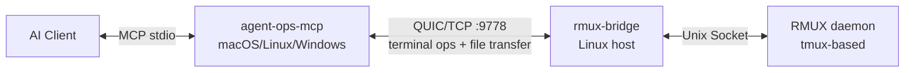

# agent-ops

> Secure infrastructure for AI agents operating Linux hosts — persistent terminal sessions powered by rmux, full-chain audit logging, MCP-native interface for all major AI clients, with file transfer and multi-host orchestration.

[中文文档](README.zh.md)

## Why agent-ops?

AI agents have evolved from "generating commands for humans" to **autonomously operating terminals** — deploying services, diagnosing failures, running long builds and training jobs, all without human intervention. But traditional terminal tools (SSH, tmux) were designed for human interaction, not programmatic API calls. agent-ops is built on **rmux**, turning terminal sessions from a human interface into a programmable resource, with three production-grade layers on top.

Three problems stand between agent prototypes and production deployment, and existing tools (plain SSH MCP servers, basic tmux wrappers) largely ignore them:

- **Reliability**: Plain SSH drops running processes on disconnect — long-running tasks fail mid-flight. Traditional tmux automation relies on `send-keys + sleep + grep`, where any timing drift breaks the workflow.
- **Auditability**: When AI operates servers in production, you must trace **who did what, when, on which machine, and with what result**. Most SSH tools lack built-in audit capabilities entirely.
- **Security boundary**: Handing SSH keys directly to an AI client is a massive attack surface. agent-ops uses Bridge proxy + Token auth + TLS encryption to confine server access to the target host — the AI side never holds server credentials.

The three layers: **Protocol layer** (MCP standard interface, works with any AI client), **Management layer** (multi-host registry, group/tag filtering, broadcast operations), and **Compliance layer** (structured SQLite audit trail, ready for operational traceability). Together they fill the infrastructure gap between agent prototypes and production readiness.

## Architecture



- **agent-ops-mcp** — MCP Server running alongside the AI client, providing 35 terminal control tools + audit CLI
- **rmux-bridge** — TLS-encrypted proxy deployed on each target Linux host, translating JSON requests to RMUX daemon calls
- **RMUX daemon** — Terminal multiplexer on each Linux host (tmux-based)

**Dependencies by component:**

| Component | Runs on | Depends on |
|-----------|---------|------------|
| `agent-ops-mcp` | AI client machine (macOS/Linux/Windows) | Nothing — just the binary |
| `rmux-bridge` | Each target Linux host | **RMUX daemon** (`curl -fsSL https://rmux.io/install.sh \| sh`) |
| RMUX daemon | Each target Linux host | tmux (usually pre-installed) |

> 💡 The bridge auto-detects the RMUX socket path during deployment. Nothing to configure manually.

## Features

| Feature | Description |
|---------|-------------|
| **Session management** | Create/destroy/list sessions, multi-pane splits, window layouts |
| **Command execution** | `exec` one-shot execution (sentinel detection + exit code), interactive programs via send_keys + capture_pane |
| **Output waiting** | `wait_for_text` for terminal text, `wait_exit` for process exit |
| **File transfer** | Upload/download over QUIC, recursive directory upload with concurrency |
| **Multi-host orchestration** | Host registry with group/tag/label filtering, broadcast_keys for multi-pane |
| **Audit logging** | SQLite audit logs for every tool call, CLI query/stats/cleanup |

## Quick Start

### Build

```bash
# Native build (macOS dev)
cargo build -p agent-ops-mcp --release

# Cross-compile bridge for Linux x86_64 (static)
just release-linux
```

### Deploy Bridge

```bash
# One-shot: generate certs, upload binary, create systemd service
just deploy host=root@<your-bridge-ip> token=<your-token>
```

### Host Registry

Create `config/hosts.yaml` (see `config/hosts.example.yaml`):

```yaml
hosts:
  - name: prod-web-01
    bridge_addr: 10.0.1.10:9778
    bridge_token: "your-token-here"
    group: production
    tags: [web, nginx]
    labels:
      dc: shanghai
```

### MCP Server Config

Edit `~/.config/opencode/opencode.json` (see `config/mcp-config.example.json`):

```json
{
  "mcp": {
    "agent-ops": {
      "type": "local",
      "command": ["/path/to/agent-ops-mcp"],
      "args": [
        "--hosts-file", "/path/to/hosts.yaml",
        "--ca-cert", "/path/to/bridge.crt"
      ],
      "enabled": true
    }
  }
}
```

## Security

| Mode | Trigger | Level |
|------|---------|:---:|
| CA verified | `--ca-cert /path/to/ca.crt` | ✅ Server identity verified, MITM-resistant |
| Skip verify | `--insecure` flag | ⚠️ Encrypted but identity not verified (debug only) |
| Reject | Neither CA nor --insecure | 🔒 Default |

**Production**: Run your own CA, issue per-bridge certificates, MCP server holds only the CA root.

## Audit

```bash
# Recent operations
agent-ops-mcp audit query --format table

# Commands on specific host
agent-ops-mcp audit query --host tf01 --action exec --since 2026-06-01

# Statistics
agent-ops-mcp audit stats

# Manual cleanup
agent-ops-mcp audit cleanup --older-than 30
```

Audit data stored at `~/.agent-ops/audit.db`, retained 90 days, max 500 MB.

## Tools

35 MCP tools covering the full terminal lifecycle:

| Category | Tools |
|----------|-------|
| Host | `host_list`, `host_filter` |
| Session | `session_create`, `session_list`, `session_attach`, `session_detach`, `kill_session` |
| Input | `send_keys`, `send_text`, `broadcast_keys` |
| Output | `capture_pane`, `wait_for_text`, `find_pane_text` |
| Execution | `exec`, `wait_exit`, `spawn_command`, `shell_command`, `respawn_pane`, `cmd_escape` |
| Pane | `split_pane`, `resize_pane`, `set_pane_title`, `close_pane`, `pane_info`, `pane_exists` |
| Window | `split_window`, `close_window`, `rename_window`, `resize_window`, `select_window`, `select_layout`, `window_info`, `list_window_panes` |
| File | `file_upload`, `file_download` |

Full docs: [docs/TOOLS.md](docs/TOOLS.md)

## Development

```bash
just check       # cargo check --workspace
just test        # cargo test --workspace
just fmt         # cargo fmt --all
just lint        # cargo clippy --workspace -- -D warnings
just build       # cargo build --workspace
```

## Tech Stack

- **Language**: Rust 1.85+ (edition 2021)
- **Async runtime**: tokio
- **TLS**: rustls (no OpenSSL dependency)
- **Terminal**: rmux-sdk
- **Audit storage**: rusqlite (bundled SQLite)
- **MCP transport**: stdio (JSON-RPC 2.0)

## Docs

- [Tool Reference](docs/TOOLS.md) — 35 MCP tools with parameters and return values
- [Deployment Guide](docs/DEPLOY.md) — Architecture, build, deploy, operations, security
- [Contributing](CONTRIBUTING.md)
- [Security Policy](SECURITY.md)
- [Changelog](CHANGELOG.md)

## License

MIT
