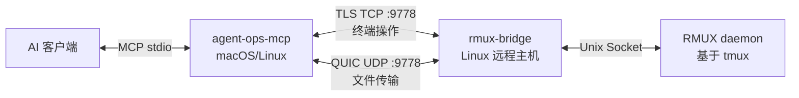

# agent-ops

> MCP Server + Bridge，让 AI Agent（OpenCode/Claude Code）远程控制 Linux 主机的交互式终端会话。

[English](README.md)

## 架构



- **agent-ops-mcp** — MCP Server，运行在 AI 客户端同机，提供 35 个终端控制工具 + 操作审计 CLI
- **rmux-bridge** — 部署在每台目标 Linux 主机上的 TLS 加密代理，将 JSON 请求翻译为 RMUX daemon 调用
- **RMUX daemon** — 每台 Linux 主机上的终端多路复用器（基于 tmux）

## 核心能力

| 能力 | 说明 |
|------|------|
| **交互式会话管理** | 创建/销毁/列举会话，多窗格分屏，窗口布局 |
| **命令执行** | `exec` 一站式执行（sentinel 检测 + exit code 提取），支持交互式程序（send_keys + capture_pane） |
| **输出等待** | `wait_for_text` 等待终端出现指定文本，`wait_exit` 等待进程退出 |
| **文件传输** | TLS 通道上传/下载，支持目录递归上传 + 并发 |
| **多主机编排** | 主机注册表 + 分组/标签/模式过滤，broadcast_keys 多窗格广播 |
| **操作审计** | SQLite 审计日志，每次工具调用自动记录，支持 CLI 查询/统计/清理 |

## 快速开始

### 构建

```bash
# 本机构建（macOS 开发）
cargo build -p agent-ops-mcp --release

# 交叉编译 bridge（Linux x86_64，静态链接）
just release-linux
```

### 部署 bridge

```bash
# 一键部署：生成证书、上传二进制、创建 systemd 服务
just deploy host=root@<your-bridge-ip> token=<your-token>
```

### 配置主机注册表

创建 `config/hosts.yaml`（参考 `config/hosts.example.yaml`）：

```yaml
hosts:
  - name: prod-web-01
    bridge_addr: 10.0.1.10:9778
    bridge_token: "your-token-here"
    group: production
    tags: [web, nginx]
    labels:
      dc: shanghai
```

### 配置 MCP Server

编辑 `~/.config/opencode/opencode.json`（参考 `config/mcp-config.example.json`）：

```json
{
  "mcp": {
    "agent-ops": {
      "type": "local",
      "command": ["/path/to/agent-ops-mcp"],
      "args": [
        "--hosts-file", "/path/to/hosts.yaml",
        "--ca-cert", "/path/to/bridge.crt"
        // 调试可用 "--insecure" 跳过证书验证（不推荐生产）
      ],
      "enabled": true
    }
  }
}
```

## 安全

| 模式 | 触发条件 | 安全等级 |
|------|---------|:---:|
| CA 验证 | `--ca-cert /path/to/ca.crt` | ✅ 验证服务器身份，防中间人 |
| 跳过验证 | `--insecure` flag | ⚠️ 加密但不验证身份（仅调试用） |
| 拒绝连接 | 既无 CA 又无 --insecure | 🔒 默认行为 |

**生产环境建议**：自建 CA，为每台 bridge 签发证书，MCP server 只持有 CA 根证书。

## 审计查询

```bash
# 查最近操作
agent-ops-mcp audit query --format table

# 查特定主机的命令执行记录
agent-ops-mcp audit query --host tf01 --action exec --since 2026-06-01

# 统计概览
agent-ops-mcp audit stats

# 手动清理
agent-ops-mcp audit cleanup --older-than 30
```

审计数据默认存储在 `~/.agent-ops/audit.db`，保留 90 天，上限 500MB。

## 工具列表

共 35 个 MCP 工具，覆盖完整终端生命周期：

| 类别 | 工具 |
|------|------|
| 主机管理 | `host_list`, `host_filter` |
| 会话管理 | `session_create`, `session_list`, `session_attach`, `session_detach`, `kill_session` |
| 终端输入 | `send_keys`, `send_text`, `broadcast_keys` |
| 终端输出 | `capture_pane`, `wait_for_text`, `find_pane_text` |
| 命令执行 | `exec`, `wait_exit`, `spawn_command`, `shell_command`, `respawn_pane`, `cmd_escape` |
| 窗格操作 | `split_pane`, `resize_pane`, `set_pane_title`, `close_pane`, `pane_info`, `pane_exists` |
| 窗口操作 | `split_window`, `close_window`, `rename_window`, `resize_window`, `select_window`, `select_layout`, `window_info`, `list_window_panes` |
| 文件传输 | `file_upload`, `file_download` |

完整工具文档见 [docs/TOOLS.md](docs/TOOLS.md)。

## 开发

```bash
just check       # cargo check --workspace
just test        # cargo test --workspace
just fmt         # cargo fmt --all
just lint        # cargo clippy --workspace -- -D warnings
just build       # cargo build --workspace
```

## 技术栈

- **语言**：Rust 1.85+（edition 2021）
- **异步运行时**：tokio
- **TLS**：rustls（无 openssl 依赖）
- **终端多路复用**：rmux-sdk
- **审计存储**：rusqlite（bundled SQLite）
- **MCP 传输**：stdio（JSON-RPC 2.0）

## 文档

- [工具文档](docs/TOOLS.md) — 35 个 MCP 工具的完整参数与返回值
- [部署文档](docs/DEPLOY.md) — 架构、构建、部署、运维、安全
- [贡献指南](CONTRIBUTING.md)
- [安全策略](SECURITY.md)
- [更新日志](CHANGELOG.md)

## License

MIT
