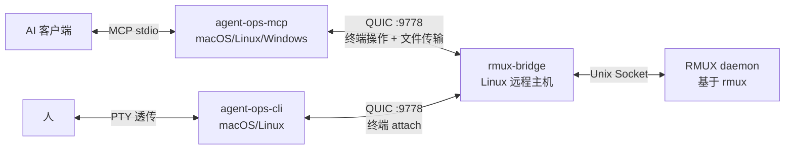

# agent-ops

> AI Agent 与人类运维远程操作 Linux 主机的安全基础设施 —— 基于 rmux 提供持久化终端会话与全链路审计日志，AI 端通过 MCP 协议调用，人类端通过 CLI PTY 透传直连，支持文件传输、端口转发与多主机编排。

[English](README.md)

## 为什么需要 agent-ops？

AI Agent 的推理和工具调用能力已经足够强，正在从「帮你生成命令」走向「自主接管终端执行任务」——部署服务、排查故障、跑编译训练长任务，全程无需人工介入。但传统终端工具（SSH、tmux）从设计之初就是给人用的交互工具，不是给程序调用的编程接口。agent-ops 基于 **rmux** 构建，把终端会话变成了 AI Agent（通过 MCP）和人类运维（通过 CLI PTY 透传）都能操作的可编程资源，在这个基础之上补了三层面向生产的封装。

生产环境落地有三个绕不开的问题，现有工具几乎都没有系统性解决：

- **可靠性**：纯 SSH 方案断连即进程终止，长任务极易失败；传统 tmux 自动化靠 `send-keys + sleep + grep`，时序偏移就会出错。
- **可审计**：企业让 AI 操作服务器，必须追溯「什么时间、哪台机器、执行了什么命令、结果如何」。纯 SSH 工具大多没有内置审计能力。
- **安全边界**：直接把 SSH 密钥交给 AI 客户端风险极高。agent-ops 通过 Bridge 代理 + Token 认证 + TLS 加密，将服务器权限收敛在目标主机本地，客户端（MCP + CLI）均不直接持有服务器密钥。

这三层分别是：**协议层**（MCP 标准接口对接 AI Agent + CLI PTY 透传供人类直接操作）、**管理层**（多主机注册、分组标签、批量广播操作）、**合规层**（全链路结构化 SQLite 审计日志，同时覆盖 MCP 和 CLI 操作），补上了 AI Agent 从原型到生产落地的基础设施缺口。

### agent-ops 能做什么

agent-ops 提供**安全、可靠、可审计的远程 Linux 操作通道**——终端访问、文件传输、端口转发。它不是 SSH（传输层）或 Ansible（配置管理）的替代品，而是一个新的品类：**远程操作平台**，将终端会话同时转化为 AI Agent（MCP）和人类（CLI PTY 透传）都能操作的可编程资源。

agent-ops 不关心终端里跑什么 —— 裸 shell 命令、Ansible Playbook、编译脚本、交互式排错，都可以。它提供的是**持久化会话 + 审计追踪 + 多主机操作**，工具由你来选。

**几种典型模式：**

```
# 模式 1：AI 读取状态、做决策、执行修复
AI Agent（通过 MCP）
  → exec: cat /proc/loadavg && df -h            # 读取系统状态
  → AI 推理："磁盘满了，/var/log 占用最多"
  → exec: du -sh /var/log/* | sort -rh | head   # 诊断
  → exec: journalctl --vacuum-size=500M          # 修复
  → audit trail: 每一步都记录在 SQLite 中

# 模式 2：人类 CLI 介入调查，AI 辅助
人类（通过 CLI PTY 透传）
  → agent-ops-cli connect tf01   # 进入 AI 正在操作的同一会话
  → vim /etc/nginx/nginx.conf  # 用熟悉的工具手动编辑
  AI Agent（通过 MCP）
  → exec: nginx -t && systemctl reload nginx   # AI 验证并生效

# 模式 3：多主机批量运维
AI（通过 MCP）
  → host_filter tags=["web"]                     # 筛选目标主机
  → batch_exec: systemctl status nginx            # 检查所有 web 服务器
  → batch_upload: nginx.conf → /etc/nginx/        # 推送配置到所有机器
  → batch_exec: nginx -s reload                   # 一键全部重载
```

**适用场景：**
- **故障排查**：AI 或人类进入一个活跃会话，读取系统状态、诊断根因、执行修复 —— 全部在一个持久化终端内完成
- **临时运维**：跨多台主机快速执行一次性命令（`batch_exec`）、文件传输、端口转发 —— 无需写 Playbook
- **交互式排错**：编译、长任务监控、交互式调试等需要持久会话的场景 —— 支持 MCP（AI）和 CLI PTY 透传（人类）两种方式
- **远程开发**：`agent-ops-cli connect devbox` —— 在自己熟悉的终端环境里操作远程机器，按 `Ctrl+G` 随时唤起 AI 辅助
- **合规审计**：覆盖 AI 和人类在每台主机上的所有操作，全链路可追溯，通过 `agent-ops-mcp audit query` 查询

## 架构



- **agent-ops-mcp** — MCP Server，运行在 AI 客户端同机，提供 63 个终端控制工具 + 操作审计 CLI
- **agent-ops-cli** — 命令行工具，人可以直接 PTY 透传 attach 到远程 rmux 会话（`agent-ops-cli connect`），内置 AI 对话面板（Ctrl+G）支持 SSE 实时流式输出，支持 vim/htop/TUI
- **rmux-bridge** — 部署在每台目标 Linux 主机上的 QUIC 加密代理，将 JSON 请求翻译为 RMUX daemon 调用
- **RMUX daemon** — 每台 Linux 主机上的终端多路复用器（基于 rmux）

**依赖关系：**

| 组件              | 运行位置                        | 依赖                                                             |
| --------------- | --------------------------- | -------------------------------------------------------------- |
| `agent-ops-mcp` | AI 客户端（macOS/Linux/Windows） | 编译后二进制（运行需 `hosts.yaml` + CA 证书） |
| `agent-ops-cli` | 运维人员机器（macOS/Linux）        | 编译后二进制（运行需 `hosts.yaml` + CA 证书） |
| `rmux-bridge`   | 每台目标 Linux 主机               | **RMUX daemon**（`curl -fsSL https://rmux.io/install.sh \| sh`） |
| RMUX daemon     | 每台目标 Linux 主机               | rmux（需要安装）                                                     |

> 💡 部署时 bridge 会自动检测 RMUX socket 路径，无需手动配置。

## 核心能力

| 能力          | 说明                                                                         |
| ----------- | -------------------------------------------------------------------------- |
| **交互式终端直连** | `agent-ops-cli connect` CLI 命令，PTY 透传至远程 rmux 会话 + 内置 AI 对话面板（Ctrl+G），SSE 实时流式输出，支持 vim/htop 等 TUI 程序 |
| **交互式会话管理** | 创建/销毁/列举会话，多窗格分屏，窗口布局                                                      |
| **命令执行**    | `exec` 一站式执行（sentinel 检测 + exit code 提取，scrollback 全量捕获大输出，断连自动重连恢复），支持交互式程序（send_keys + capture_pane） |
| **输出等待**    | `wait_for_text` 等待终端出现指定文本，`wait_exit` 等待进程退出                              |
| **文件传输**    | QUIC 通道上传/下载，支持目录递归上传和下载 + 并发                                              |
| **端口转发**    | 通过 QUIC 隧道访问远程内网服务（数据库、API 等）                                              |
| **多主机编排**   | 主机注册表 + 分组/标签/模式过滤，broadcast_keys 多窗格广播                                    |
| **操作审计**    | SQLite 审计日志，每次工具调用自动记录，支持 CLI 查询/统计/清理                                     |
| **终端状态感知**  | `capture_pane`、`exec`、`wait_for_text`、`wait_stable`、`pane_info` 返回 `terminal_state`（ready/running/editor/pager/password/confirm/repl/unknown）和光标位置，让 AI Agent 理解终端当前状态 |
| **exec 安全检查** | `exec` 在终端非 `ready` 状态时拒绝执行（如在 vim、less、密码提示中），返回 `refused: true` 并给出操作建议，防止命令注入到非 shell 上下文 |

### AI 对话面板快捷键

在 AI 面板中（通过 `Ctrl+G` 激活）：

| 按键 | 操作 |
|------|------|
| `Ctrl+G` / `Esc` | 关闭 AI 面板，返回终端 |
| `Enter` | 发送消息 |
| `Backspace` | 删除上一个字符 |
| `↑` / `PageUp` | 向上滚动消息历史（更早的消息） |
| `↓` / `PageDown` | 向下滚动消息历史（更新的消息） |
| `鼠标滚轮` | 滚动消息历史 |

| 命令 | 操作 |
|------|------|
| `@analyze` | 分析当前终端内容 |
| `@clear` | 清空对话历史 |

AI 面板首次提问时自动启动 `opencode serve` 进程（端口 14096），面板关闭/重开不杀进程，CLI 退出时自动清理。可通过 `--opencode-dir <path>` 指定工作目录（默认当前目录）。

PTY 透传模式支持鼠标滚轮和触摸板手势（SGR 鼠标协议）。

## 快速开始

### 构建

```bash
# 本机构建（macOS 开发）
cargo build -p agent-ops-mcp --release
cargo build -p agent-ops-cli --release

# 交叉编译 bridge + MCP server（Linux x86_64，静态链接）
just release-linux
```

### 部署

```bash
# 步骤 1：部署 rmux daemon（远程主机）
bash deploy/install-daemon.sh root@<your-bridge-ip>

# 步骤 2：编译并部署 bridge（一键）
just release-linux
just deploy host=root@<your-bridge-ip> token=<your-token>
```

### 配置主机注册表

创建 `config/hosts.yaml`（参考 `config/hosts.example.yaml`）：

```yaml
hosts:
  - name: prod-web-01
    bridge_addr: 10.0.1.10:9778
    bridge_token: "your-token-here"
    group: production
    tags: [web, nginx]
    labels:
      dc: shanghai
```

> 💡 **热加载**：修改 `hosts.yaml` 后无需重启 — 调用 `reload_config` MCP 工具或向 MCP Server 进程发送 `kill -HUP <pid>` 即可生效。

### 配置 MCP Server

编辑 `~/.config/opencode/opencode.json`（参考 `config/mcp-config.example.json`）：

```json
{
  "mcp": {
    "agent-ops": {
      "type": "local",
      "command": ["/path/to/agent-ops-mcp"],
      "args": [
        "--ca-cert", "/path/to/ca.crt",
        "--hosts-file", "/path/to/hosts.yaml"
      ],
      "enabled": true
    }
  }
}
```

> 远程部署使用 `ca.crt`；本地自签名测试可用 `bridge.crt`。

## 安全

| 模式 | 说明 |
|------|------|
| CA 验证（必填） | `--ca-cert` 为必填参数。始终通过 CA 根证书验证服务器身份，防中间人攻击。未提供则 MCP 服务器无法启动。 |

**生产环境建议**：自建 CA，为每台 bridge 签发证书，MCP server 只持有 CA 根证书。

**内置安全防护**：
- **路径穿越防护**：文件上传/下载拒绝包含 `..` 的路径
- **隧道目标白名单**：`hosts.yaml` 中可选配置 `allowed_tunnel_targets` 限制端口转发目标（支持 glob 模式）
- **exec 安全检查**：`exec` 在终端非 `ready` 状态时拒绝执行（防止命令注入到 vim/less/密码提示等）

## 审计查询

```bash
# 查最近操作
agent-ops-mcp audit query --format table

# 查特定主机的命令执行记录
agent-ops-mcp audit query --host tf01 --action exec --since 2026-06-01

# 统计概览
agent-ops-mcp audit stats

# 手动清理
agent-ops-mcp audit cleanup --older-than 30
```

审计数据默认存储在 `~/.agent-ops/audit.db`，保留 90 天，上限 500MB。

## 知识库沉淀（设计理念）

agent-ops 的审计系统记录了每一次操作的详尽日志，但原始审计数据只能回答「发生了什么」，无法回答「为什么会发生」或「下次怎么修」。本章阐述如何将运维经验转化为共享知识库的**设计思路**。具体实现方案由用户自行决定 —— 因为知识库后端取决于团队已有的基础设施，不应由工具越俎代庖。

### 痛点

AI 辅助完成一次问题排查后：

- **经验留在本地**：诊断过程、根因、修复方案只存在于对话记录中。
- **无法共享**：团队成员遇到类似问题时无法搜索历史案例。
- **手工负担重**：事后再凭记忆写复盘或 Wiki，上下文早已模糊。

### 三层架构

```
┌─────────────┐   session 活动记录    ┌──────────────────┐
│  agent-ops  │ ─── 审计事件 ───────→ │  知识提取层        │
│  (MCP)      │    (SQLite)           │  (AI 回顾+总结)    │
└─────────────┘                       └────────┬─────────┘
                                               │ 结构化知识条目
                                               ▼
                                      ┌──────────────────┐
                                      │  输出适配器        │
                                      │  (用户自定义)      │
                                      └───┬──┬──┬──┬────┘
                                          │  │  │  │
                                     ONES │ wiki GitBook ...
                                          │
                                    curl / git / webhook
```

#### 1. 采集层（已内置）
现有的**审计系统**自动记录每次 MCP 工具调用和 CLI 操作 —— `exec`、`capture_pane`、`session_create`、`connect` 等 —— 包含时间戳、目标主机、成功/失败状态、错误信息。无需额外改动。

#### 2. 提取层（AI 驱动）
当用户主动触发「把这个排查沉淀成知识」时，AI 回顾本次会话的完整对话历史 + 对应审计记录，提取：

| 字段 | 来源 |
|------|------|
| 问题现象 | 用户初始描述、异常输出 |
| 诊断路径 | `exec` / `capture_pane` 调用序列 |
| 根因 | 定位到的最终原因 |
| 解决方案 | 最终执行的修复命令或配置变更 |
| 关联主机/标签 | 审计事件的元数据 |

输出为**结构化 JSON**，而非 Markdown —— 方便输出适配器按需转换为任意格式。

#### 3. 输出层（用户自定义）
不绑定任何特定平台。用户定义**输出适配器（sink）**—— 一个脚本、命令或 webhook，通过 `stdin` 接收 JSON 知识条目。示例：

```bash
# ~/.agent-ops/sink.sh — 推送到 ONES Wiki
curl -X POST "https://ones.example.com/wiki/api" \
  -H "Authorization: Bearer $TOKEN" \
  -d "$(cat)"
```

```bash
# 推送到 git 知识库
echo "$(cat)" >> knowledge.jsonl && git commit -am "新增排障经验条目"
```

### 设计原则

- **用户决定时机**：知识提取由用户主动触发，而非自动 —— 避免不完整的排查会话产生噪音条目。
- **用户决定去向**：不绑定平台，sink 就是你团队已经在用的 CLI/API。
- **用户审核后发布**：AI 生成的条目应经人工审核、修改后再推送到共享存储。
- **JSON 作为交换格式**：结构化数据可以随时转换为 Markdown、API 请求体、数据库行等。

这个设计让 agent-ops 专注于运维操作本身，同时为团队在已有审计数据之上构建自己的知识流水线提供了清晰的思路和起点。

## 工具列表

共 63 个 MCP 工具，覆盖完整终端生命周期；另有 `audit query/stats/cleanup` CLI 子命令供人类直接查询审计日志：

| 类别 | 工具 |
|------|------|
| 主机管理 | `host_list`, `host_filter`, `reload_config` |
| 会话管理 | `session_create`, `session_list`, `session_attach`, `session_detach`, `kill_session` |
| 终端输入 | `send_keys`, `send_text`, `broadcast_keys` |
| 终端输出 | `capture_pane`, `capture_region`, `wait_for_text`, `wait_for_bytes`, `find_pane_text`, `find_text_all`, `stream_pane` |
| 命令执行 | `exec`, `wait_exit`, `wait_stable`, `collect_until_exit`, `spawn_command`, `shell_command`, `respawn_pane`, `cmd_escape` |
| 窗格操作 | `split_pane`, `split_pane_with`, `break_pane`, `join_pane`, `swap_pane`, `resize_pane`, `set_pane_title`, `get_pane_title`, `clear_history`, `close_pane`, `pane_info`, `pane_exists` |
| 窗口操作 | `split_window`, `close_window`, `rename_window`, `resize_window`, `select_window`, `select_layout`, `window_info`, `list_window_panes` |
| 发现与查询 | `find_panes`, `find_sessions`, `get_pane_by_title`, `host_capabilities` |
| 粘贴板 | `list_buffers`, `paste_buffer`, `delete_buffer` |
| 文件传输 | `file_upload`, `file_download` |
| 批量操作 | `batch_exec`, `batch_upload`, `batch_download` |
| 端口转发 | `tunnel_create`, `tunnel_list`, `tunnel_close` |
| 部署升级 | `deploy_bridge` |
| 系统 | `agent_ops_usage_rules` |

> 💡 `stream_pane` 适用于长命令实时输出监控（阻塞读，增量返回），替代 capture_pane 轮询。

完整工具文档见 [docs/TOOLS.md](docs/TOOLS.md)。

## 开发

```bash
just check       # cargo check --workspace
just test        # cargo test --workspace
just fmt         # cargo fmt --all
just lint        # cargo clippy --workspace -- -D warnings
just build       # cargo build --workspace
```

## 技术栈

- **语言**：Rust stable（edition 2021）
- **异步运行时**：tokio
- **TLS**：rustls（无 openssl 依赖）
- **终端多路复用**：rmux-sdk
- **审计存储**：rusqlite（bundled SQLite）
- **MCP 传输**：stdio（JSON-RPC 2.0）

## 文档

- [工具文档](docs/TOOLS.md) — 63 个 MCP 工具的完整参数与返回值
- [部署文档](docs/DEPLOY.md) — 架构、构建、部署、运维、安全
- [贡献指南](CONTRIBUTING.md)
- [安全策略](SECURITY.md)
- [更新日志](CHANGELOG.md)

## License

MIT
